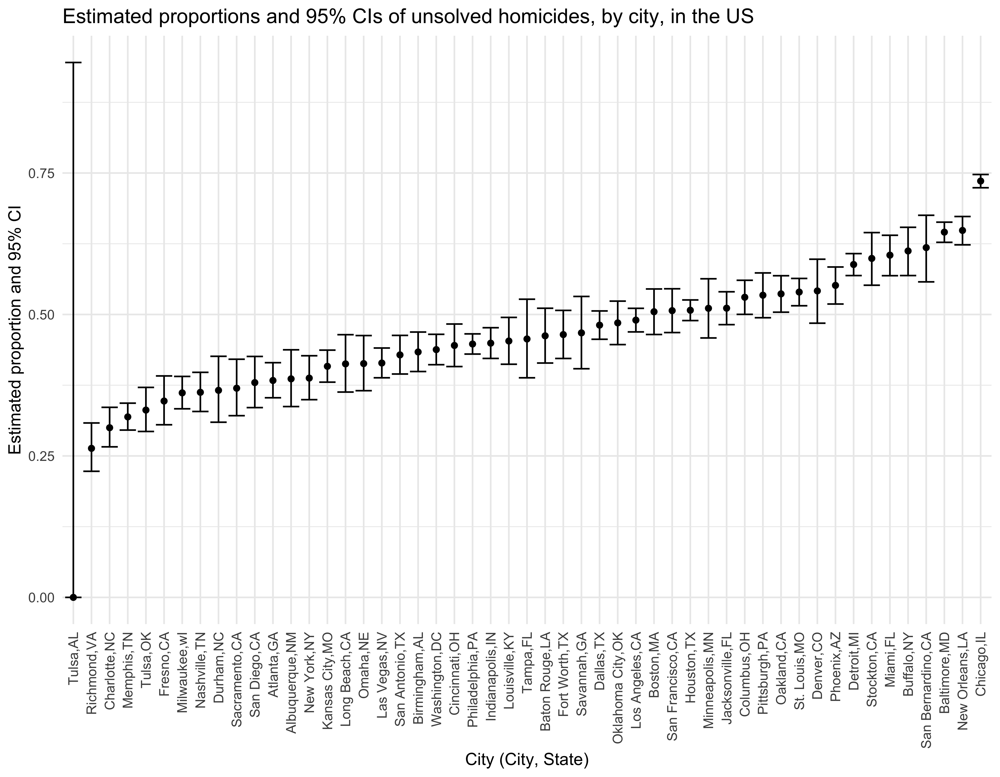

Data Science HW-5
================
Kasturi Bhamidipati
2022-11-14

# Problem 1

# Problem 2

## Importing the data

First we want to import the data.

``` r
homicide_raw = 
  read_csv(file = "./data/homicide-data.csv")
```

    ## Rows: 52179 Columns: 12
    ## ── Column specification ────────────────────────────────────────────────────────
    ## Delimiter: ","
    ## chr (9): uid, victim_last, victim_first, victim_race, victim_age, victim_sex...
    ## dbl (3): reported_date, lat, lon
    ## 
    ## ℹ Use `spec()` to retrieve the full column specification for this data.
    ## ℹ Specify the column types or set `show_col_types = FALSE` to quiet this message.

## Summary of the dataset

-   The `homicide` dataset has 52179 rows and 12 columns.
-   It has the following variables: uid, reported_date, victim_last,
    victim_first, victim_race, victim_age, victim_sex, city, state, lat,
    lon, disposition

## Creating `city_state` variable and summarizing

``` r
homicide_data = 
  homicide_raw%>%
  janitor::clean_names()%>%
  mutate(
    city_state = str_c(city,state, sep = ","),
    status = 
      case_when(
        disposition == "Closed without arrest" ~ "unsolved", 
        disposition == "Open/No arrest" ~ "unsolved", 
        disposition == "Closed by arrest" ~ "solved"
      ))%>%
  group_by(city_state)%>%
  summarise(
    total= n(), 
    unsolved = sum(status=="unsolved")
  )
```

## `prop.test` for Baltimore and saving output as R object

``` r
prop.test(
  homicide_data %>% filter(city_state == "Baltimore,MD") %>% 
    pull(unsolved),
  homicide_data %>% filter(city_state == "Baltimore,MD") %>% 
    pull(total)) %>% 
  broom::tidy()%>% 
  saveRDS(., "./data/Baltimore_prop_test.rds")
```

## `prop.test` for each city

``` r
homicide_data_pt = 
  homicide_data%>%
  mutate(
    prop_df =map2(.x = unsolved, .y = total, ~prop.test(x = .x, n = .y)),
    tidied =map(.x = prop_df, ~broom::tidy(.x))
    ) %>% 
  select(-prop_df) %>% 
  unnest(tidied) %>% 
  select(city_state, estimate, conf.low,conf.high)

homicide_data_pt
```

    ## # A tibble: 51 × 4
    ##    city_state     estimate conf.low conf.high
    ##    <chr>             <dbl>    <dbl>     <dbl>
    ##  1 Albuquerque,NM    0.386    0.337     0.438
    ##  2 Atlanta,GA        0.383    0.353     0.415
    ##  3 Baltimore,MD      0.646    0.628     0.663
    ##  4 Baton Rouge,LA    0.462    0.414     0.511
    ##  5 Birmingham,AL     0.434    0.399     0.469
    ##  6 Boston,MA         0.505    0.465     0.545
    ##  7 Buffalo,NY        0.612    0.569     0.654
    ##  8 Charlotte,NC      0.300    0.266     0.336
    ##  9 Chicago,IL        0.736    0.724     0.747
    ## 10 Cincinnati,OH     0.445    0.408     0.483
    ## # … with 41 more rows

## Plot for estimates and CIs for each city

``` r
homicide_plot = 
  homicide_data_pt%>% 
  ggplot(aes(x = fct_reorder(city_state, estimate), y = estimate))+ 
  geom_point()+
  geom_errorbar(aes(ymin = conf.low, ymax = conf.high)) +
  theme(axis.text.x = element_text(angle = 90, vjust = 0.5, hjust = 1))+
  labs(title = "Estimated proportions and 95% CIs of unsolved homicides, by city, in the US",
       x = "City (City, State)",
       y = "Estimated proportion and 95% CI")

homicide_plot
```



``` r
ggsave(path = "results", "homicide_plot.pdf")
```

    ## Saving 9 x 7 in image

# Problem 3

## Setting up my simulation

First I want to set up a simulation with the following design elements:
n = 30, σ = 5 and μ = 0.

``` r
initial_sim = function(n = 30, sigma = 5, mu = 0) {
  x = rnorm(n, mean = mu, sd = sigma)
  t_test = t.test(x, conf.int = 0.95)%>%
    broom::tidy()
  
    t_test
}
```
